# 🧠 EEG Fog–Cloud Analytics Pipeline

## 📌 1. Visión general

Este proyecto implementa una **arquitectura Fog–Cloud** para el procesamiento de eventos EEG en tiempo real(simulado), orientada a la **detección temprana de sesiones sospechosas**, el **almacenamiento histórico de eventos**, la **analítica offline(posteriormente)** y la **emisión de alertas automáticas**.

La solución combina **procesamiento cercano a la fuente (Fog Computing)** con **servicios serverless en AWS**, logrando un sistema escalable, desacoplado y adecuado para entornos clínicos donde la latencia, el costo y la trazabilidad son factores críticos.

---

## 🎯 2. Objetivos del proyecto

- Procesar eventos EEG de forma continua y escalable.
- Mantener estado agregado por sesión (ventanas totales y sospechosas).
- Almacenar eventos para análisis histórico.
- Permitir consultas analíticas mediante SQL.
- Emitir alertas automáticas cuando se superan umbrales clínicos.
- Demostrar un enfoque arquitectónico Fog + Cloud realista.

---

## 🏗️ 3. Arquitectura general


La arquitectura está dividida en tres grandes capas:

- **Obtencion de señales cerebrales**: Colocación de electrodos en la cabeza de pacientes en observación.
- **Fog Computing**: procesamiento cercano a la fuente (hospital).
- **Cloud Computing (AWS)**: ingestión, persistencia, analítica y alertas.

---

## 🔄 4. Flujo general de datos

1. Captura de señales EEG en pacientes hospitalarios.
2. Procesamiento inicial en nodos Fog.
3. Envío de eventos EEG a Amazon Kinesis Data Streams.
4. Procesamiento de eventos mediante AWS Lambda.
5. Almacenamiento de eventos en Amazon S3.
6. Catalogación de datos con AWS Glue Data Catalog.
7. Consultas analíticas usando Amazon Athena.
8. Almacenamiento de resultados de consultas en S3.
9. Mantenimiento del estado de sesión en Amazon DynamoDB.
10. Evaluación de umbrales clínicos.
11. Notificación de alertas mediante Amazon SNS.

---

## 🌫️ 5. Capa Fog Computing

### 5.1 Rol del Fog

La capa Fog permite realizar procesamiento **cercano a los pacientes**, reduciendo:

- Latencia
- Tráfico innecesario hacia la nube
- Costos de almacenamiento y cómputo

### 5.2 Funciones principales

- Lectura de archivos EEG ( formato *.edf* ).
- Segmentación/procesamiento en ventanas temporales de 4 *seg*.
- Inferencia con un modelo ligero llamado ligera *EEGNet* [1].
- Conteo de ventanas sospechosas.
- Decisión condicional de subida de EDF completos a la nube.

### 5.3 Justificación

El Fog actúa como un **primer filtro inteligente**, enviando a la nube solo información relevante y eventos procesados, lo cual es fundamental en escenarios clínicos reales.

### 5.4 Simulación

La simulación consiste en la extracción de las señales cerebrales de varios pacientes de dos habitaciones de un hospital, esta simulacion se hace en dos terminales de linux de tal manera que cada habitación(terminal) envia de manera independiente las señales al componente Fog:

#### 5.4.1 ***SimulaciónHabitacion #1(Terminal #1)***:

```bash
python -m fog.room_simulators.run_room --room room_A 
```

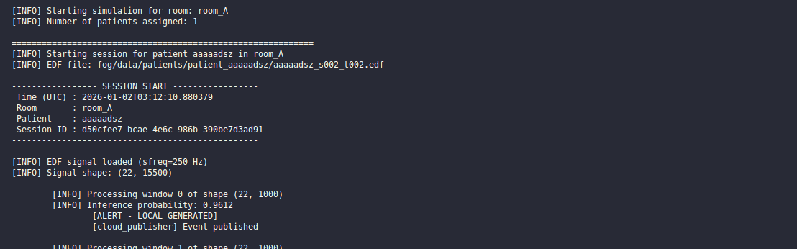

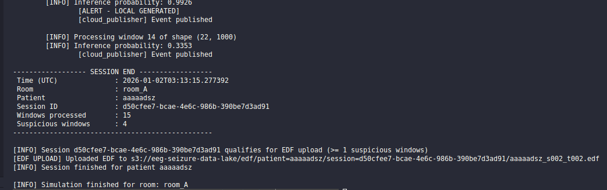


#### 5.4.2 ***SimulaciónHabitacion #2(Terminal #2)***:

```bash
python -m fog.room_simulators.run_room --room room_B 
```

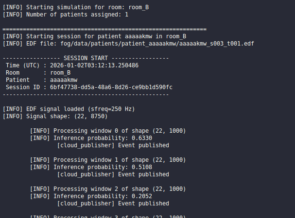

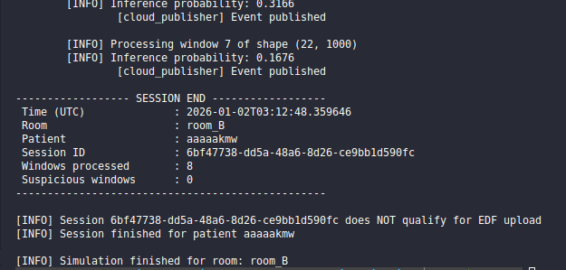

---

## ☁️ 6. Capa Cloud Computing (AWS)

### 📡 Amazon Kinesis Data Streams

**Rol:** Ingestar eventos EEG en tiempo real.  
**Justificación:** Permite múltiples productores (nodos Fog), desacopla la ingesta del procesamiento y soporta flujos continuos de datos.

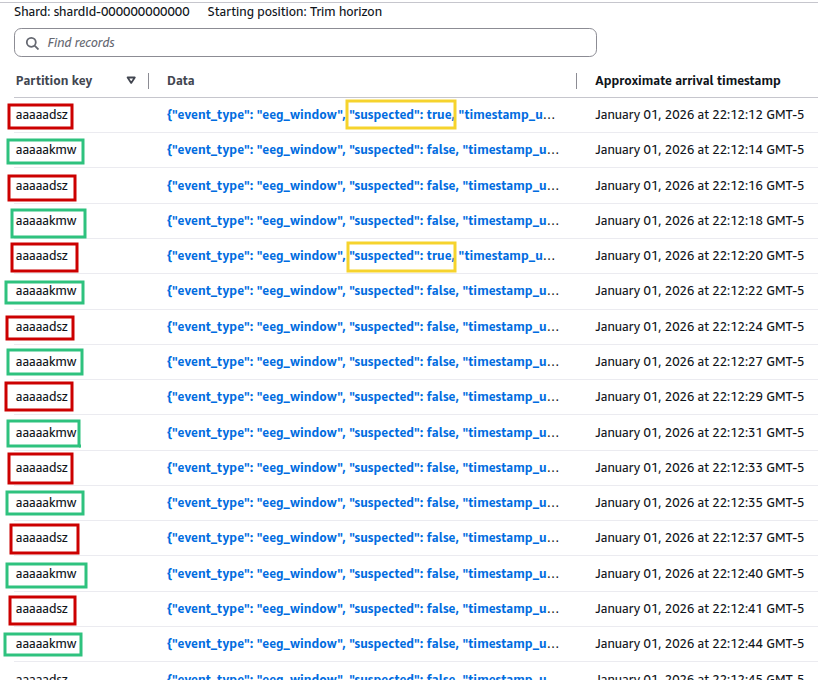

---

### ⚙️ AWS Lambda – Procesamiento de eventos

**Rol:** Procesar eventos EEG.  
**Responsabilidades:**

- Decodificar eventos provenientes de Kinesis.
- Persistir eventos en S3.
- Actualizar el estado de sesión en DynamoDB.

Este Lambda se ejecuta de forma **event-driven** y escala automáticamente según la carga.

El evento que persistimos en S3 tiene el siguiente formato:

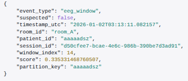

Ademas hacemos una actualizacion del total de ventanas y de las ventanas sospechosas del paciente `event[patient_id]`:

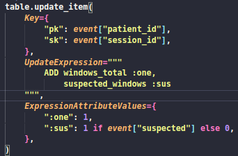

---

### 🗂️ Amazon S3 – Data Lake de eventos

**Rol:** Almacenar eventos EEG históricos.  
**Justificación:** S3 actúa como un data lake de bajo costo, altamente escalable y base para la analítica offline.

Para el iguiente paciente estructurado con la fecha podemos ver los `.json` de todos los eventos de dicho paciente:

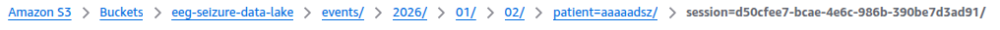

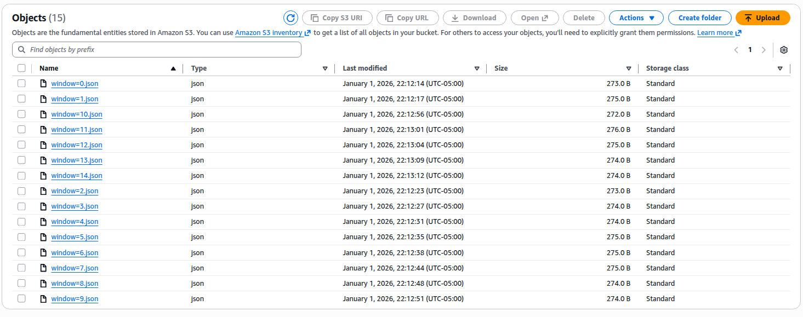

Ademas como criterio que se establecio en el componente fog se sube toda la señal completa `.edf` file: 

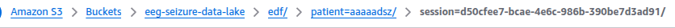


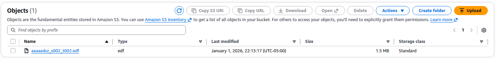

---

### 📊 Amazon DynamoDB – Estado de sesiones

**Rol:** Mantener estado agregado por sesión.  
**Información almacenada:**

- Total de ventanas procesadas.
- Total de ventanas sospechosas.
- Identificadores de paciente y sesión.

**Justificación:** DynamoDB ofrece baja latencia y es ideal para contadores y estados incrementales.

A continuación se presenta la tabla actualizada de los dos clientes, sus ventanas totales y ventanas sospechosas.

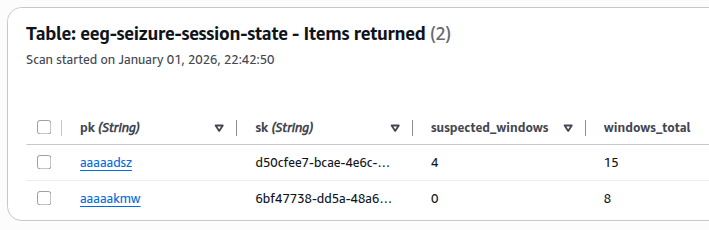

---

### 🧾 AWS Glue Data Catalog

**Rol:** Catalogar los eventos almacenados en S3.  
**Justificación:** Permite descubrir el esquema de los datos y habilita consultas SQL sin necesidad de definir tablas manualmente.

Se define el siguiente esquema que tiene com source el data lake que persistimos en s3:

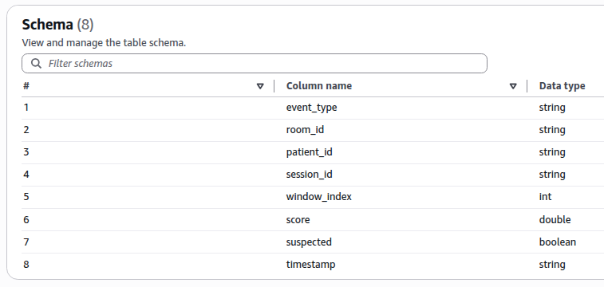


---

### 🔍 Amazon Athena

**Rol:** Consultar eventos EEG mediante SQL.  
**Ejemplos de consultas:**

Una vez definido nuestro catalogo con `AWS Glue` podemos hacer la siguientes consultas:

- ¿Cuántas ventanas sospechosas por paciente?

```sql
--- Cuántas ventanas sospechosas por paciente?
SELECT
    patient_id,
    COUNT(*) AS suspected_windows
FROM eeg_seizure_events_db.eeg_window_events
WHERE suspected = true
GROUP BY patient_id
ORDER BY suspected_windows DESC;
```

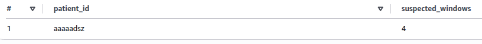

- ¿Cuántas sesiones activas por día?

```sql
--- ¿Cuántas sesiones activas por día?
SELECT
    DATE(substr(timestamp, 1, 10)) AS event_date,
    COUNT(DISTINCT session_id) AS active_sessions
FROM eeg_seizure_events_db.eeg_window_events
GROUP BY DATE(substr(timestamp, 1, 10))
ORDER BY event_date;
```

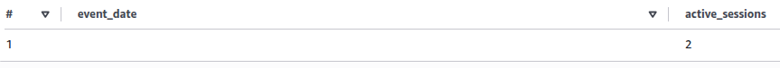

- ¿En qué cuartos ocurre mayor frecuencia de eventos?

```sql
--- ¿En qué cuartos ocurre mayor frecuencia de eventos?
SELECT
    room_id,
    COUNT(*) AS total_events,
    SUM(CASE WHEN suspected THEN 1 ELSE 0 END) AS suspected_events
FROM eeg_seizure_events_db.eeg_window_events
GROUP BY room_id
ORDER BY suspected_events DESC;
```

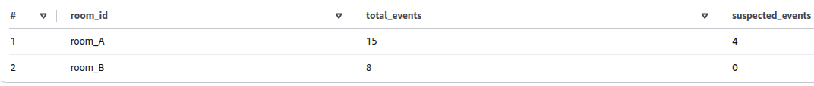

- Evolución temporal de scores sospechosos.
- Sesiones que superaron un umbral clínico.

Los resultados de las consultas se almacenan automáticamente en S3.

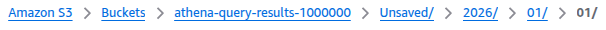

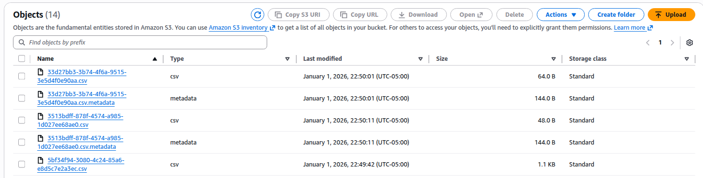


---

### 🚨 AWS Lambda – Evaluación de alertas

**Rol:** Detectar sesiones críticas.  
**Trigger:** DynamoDB Streams.  
**Responsabilidades:**

- Evaluar si una sesión supera un umbral configurable.
- Construir mensajes de alerta.
- Publicar notificaciones en SNS.

Este Lambda está desacoplado del procesamiento principal para mantener responsabilidades claras.

```python
for record in  records:
        print("record index:", idx)
        idx+=1
        print(f"[handler] Processing record: {json.dumps(record)}")
        if record["eventName"] not in ("INSERT", "MODIFY"):
            continue

        new_image = record["dynamodb"].get("NewImage")
        print(f"[handler] NewImage: {json.dumps(new_image)}")
        if not new_image:
            continue

        suspected = int(new_image["suspected_windows"]["N"])
        total = int(new_image["windows_total"]["N"])

        if suspected >= THRESHOLD:
            print("[handler] suspected >= THRESHOLD, sending alert")
            message = {
                "alert_type": "SESSION_THRESHOLD_EXCEEDED",
                "patient_id": new_image["pk"]["S"],
                "session_id": new_image["sk"]["S"],
                "suspected_windows": suspected,
                "windows_total": total,
            }

            sns.publish(
                TopicArn=SNS_TOPIC_ARN,
                Subject="⚠️ Alerta EEG: sesión sospechosa",
                Message=json.dumps(message, indent=2),
            )
```

---

### 📣 Amazon SNS – Sistema de notificaciones

**Rol:** Notificar alertas clínicas.  
**Canales:** Email (extensible a SMS, HTTP, apps).  
**Justificación:** SNS permite desacoplar la generación de alertas del canal de entrega.


---

## 🧠 7. Justificación de decisiones arquitectónicas

- **Fog + Cloud:** balance entre latencia, costo y escalabilidad.
- **Dos Lambdas:** separación clara entre procesamiento y evaluación.
- **Kinesis:** ingesta robusta y desacoplada.
- **DynamoDB:** estado incremental de baja latencia.
- **S3 + Athena:** analítica flexible y económica.
- **SNS:** notificaciones desacopladas y extensibles.

---

## 🧱 8. Infraestructura como Código (IaC)

Toda la infraestructura Cloud está definida usando **Pulumi**, lo que permite:

- Reproducibilidad
- Versionado
- Despliegues controlados
- Auditoría de cambios

Luego el entorno virtual ya creado e instalado los requirements.txt, hacemos:

```bash
pulumi up --yes
```

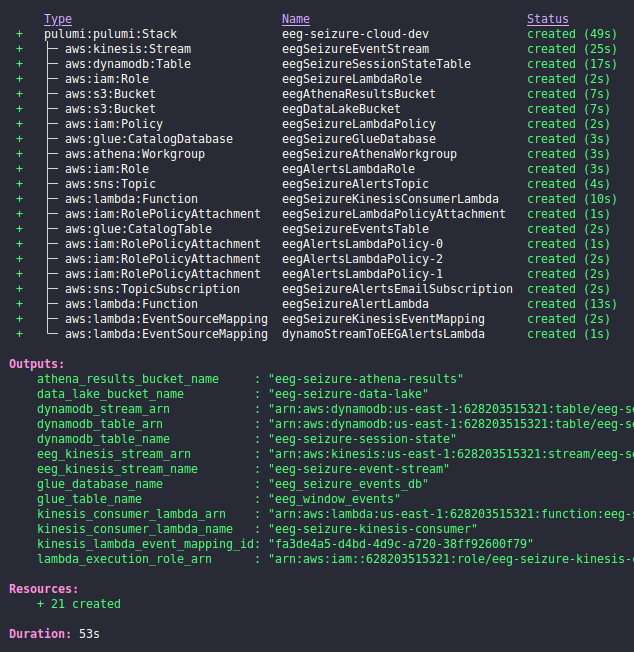

---

## 📁 9. Estructura del proyecto

```text
eeg-seizure-fog-cloud-analytics-pipeline/
├── fog/
│   ├── config/
│   ├── data/
│   ├── models/
│   ├── pipeline/
│   ├── room_simulator/
│   ├── venv_fog/
│   └── requirements.txt
├── cloud/
│   ├── components/
│   │   ├── streaming/
│   │   ├── compute/
│   │   ├── storage/
│   │   ├── analytics/
│   │   ├── messaging/
│   │   ├── security/
│   │   └── database/
│   ├── lambda_src/
│   ├── __main__.py
│   └── Pulumi.yaml
├── docs/
│   └── screenshots/
│       ├── arquitectura.png
│       ├── fog_pipeline.png
│       ├── kinesis_logs.png
│       ├── athena_queries.png
│       └── sns_alert.png
└── README.md
```

---

## 📁 10. Referencias

- [1] Lawhern, V. J., Solon, A. J., Waytowich, N. R., Gordon, S. M., Hung, C. P., & Lance, B. J. (2018). EEGNet: a compact convolutional neural network for EEG-based brain–computer interfaces. Journal of neural engineering, 15(5), 056013. 

- [2] Godfrey, M. (2023). EEG Analytics Models Using AWS.